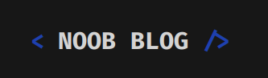

# noob-blog

## 🇬🇧 A Markdown blog made with Next JS

This is a blog built with Next JS, consisting of statically generated sites with Next and markdown files written in the src/posts directory. It is an open solution, so feel free to copy it and create your own blog with it.

> Instructions for creating content are in [how-to-publish](./how-to-publish.txt)

`Link to my blog:` [Here](https://leonardof02.github.io/noob-blog)

---

## 🇪🇸 Un de blog de Markdown hecho con Next JS

Este es un blog hecho con Next JS, consiste en sitios estaticos generados con Next y archivos markdown escritos en el directorio `src/posts` es una solucion abierta y sientete libre de copiarla y crearte tu propio blog con ella

> Las instrucciones para crear contenido están en [how-to-publish](./how-to-publish.txt)

`Enlace a mi blog:` [Aquí](https://leonardof02.github.io/noob-blog)
